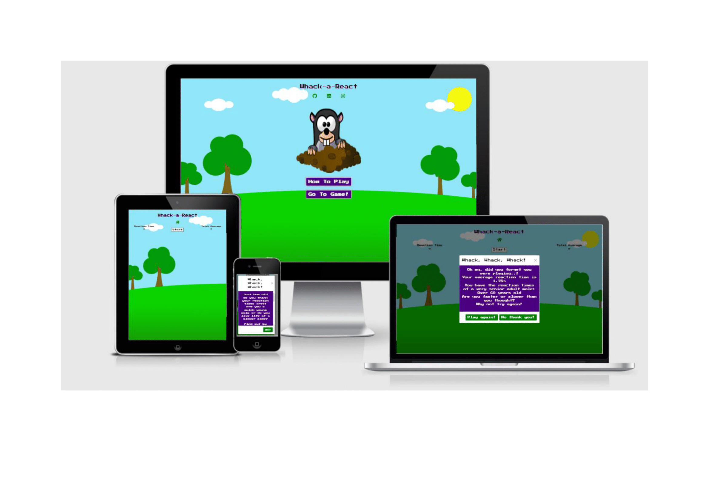
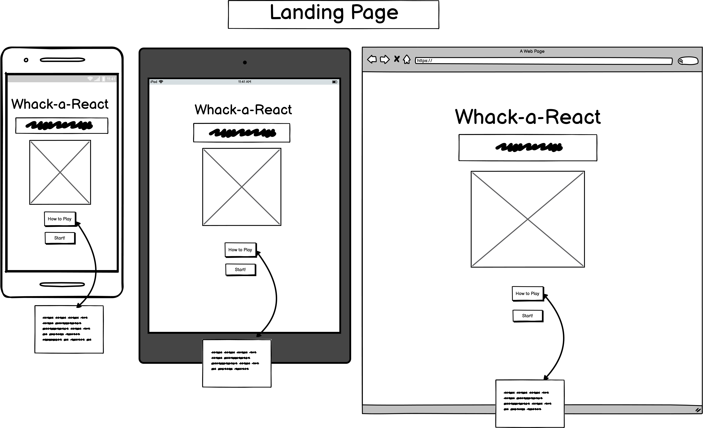
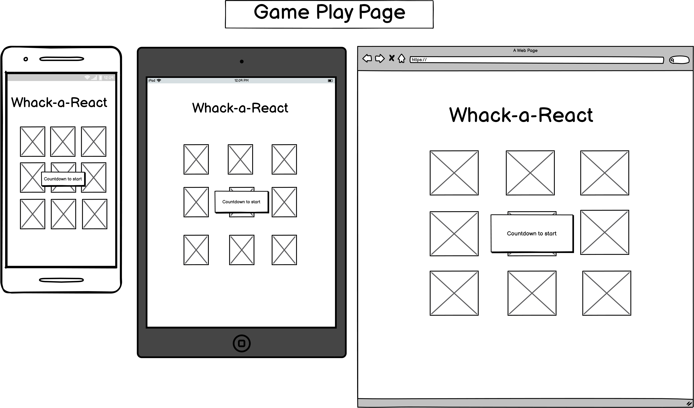
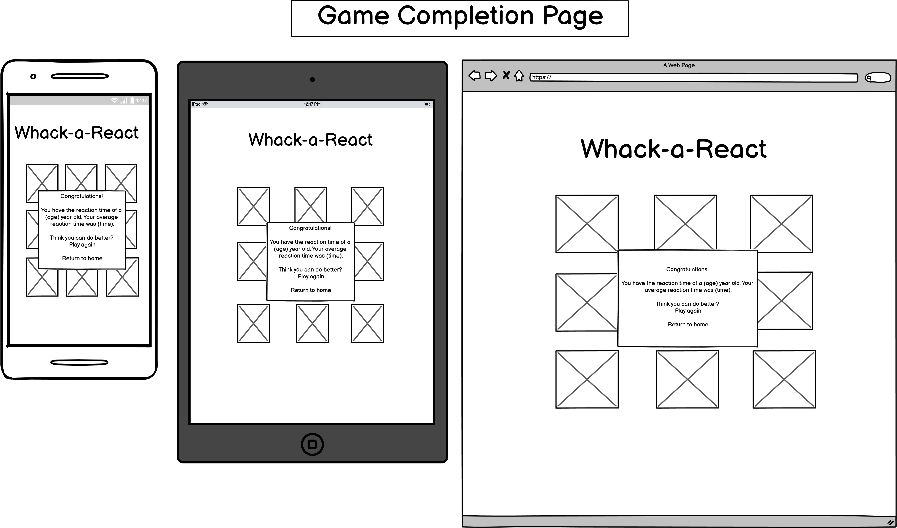

Live site can be found [here.](https://janelleg51.github.io/Whack-a-React/)

## Table of Contents
- [Whack-a-React](#whack-a-react)
    - [User Objectives](#user-objectives)
  - [UX](#ux)
    - [Target Audience](#target-audience)
    - [User Stories](#user-stories)
      - [New Users](#new-users)
      - [Returning Users](#returning-users)
  - [Visuals](#visuals)
    - [Imagery](#imagery)
    - [Fonts](#fonts)
    - [Colours](#colours)
    - [Wireframes](#wireframes)
  - [Features](#features)
    - [Features across all pages](#features-across-all-pages)
      - [**Home Page**](#home-page)
      - [**Game Page**](#game-page)
      - [**Interactive Game Play**](#interactive-game-play)
      - [**Game Completion**](#game-completion)
    - [Existing Features](#existing-features)
      - [**Branding**](#branding)
      - [**Social Media Links**](#social-media-links)
      - [**How to Play Modal**](#how-to-play-modal)
      - [**Start Button**](#start-button)
      - [**Reaction Time**](#reaction-time)
      - [**Total average**](#total-average)
      - [**Results Modal**](#results-modal)
    - [Features Left to Implement](#features-left-to-implement)
  - [Technologies Used](#technologies-used)
  - [Testing](#testing)
    - [User Stories testing:](#user-stories-testing)
  - [Manual Functionality Testing](#manual-functionality-testing)
    - [Issue and Fixes](#issue-and-fixes)
  - [Deployment](#deployment)
    - [Deploying](#deploying)
    - [Forking](#forking)
    - [Cloning](#cloning)
  - [Credits](#credits)
    - [Content](#content)
    - [Code](#code)
    - [Acknowledgements](#acknowledgements)

<small><i><a href='http://ecotrust-canada.github.io/markdown-toc/'>Table of contents generated with markdown-toc</a></i></small>

# Whack-a-React 
Whack-a-React is a just for fun reaction time game which combines the similar game play of Whac-A-Mole invented in 1975 by Kazuo Yamada and the results from a reaction time study conducted in 2014, [Just Park](https://www.justpark.com/creative/reaction-time-test/).
This is not an empirical scientific experiment but is just fun way to get an idea of how old your reaction times are! Are they older or younger than your actual age? Can you improve them? Do you notice any difference depending on what time of day it is?!

This is game for all ages and performance may vary between devices. For the most accurate results, this game is best played on mobile devices.

### User Objectives
- To seek some quick, light entertainment.
- To feel nostalgic about possible childhood games.
- To gain a loose age comparison of their reaction times in a fun way.
- Attempt to improve their reaction times.
- Identify any particular variables that may have an impact on their reaction times.
## UX
### Target Audience 
This game is aimed at all demographics with the only exclusions being very young children and those that are visually impaired. The primary target audience for this site are those that regularly access gaming apps on their mobile phones while travelling, waiting or in need of a brief light entertainment distraction.
### User Stories 
#### New Users
1.	As a new user, I would like the presentation of the game to feel fun and engaging.
2.	As a new user, I would like the game to look and feel retro and simplistic.
3.	As a new user, I want to be able to easily understand how to play the game.
4.	As a new user, I want the game play to be fully responsive when interacted with.
5.	As a new user, I want all messages to be clearly visible and easy to read.
#### Returning Users
1.	As a returning user, I would like my previous results to be stored to allow tracking of any improvement or detriment in reaction times.

## Visuals 

### Imagery 
 
The cartoon mole image used in the game was taken from [Free SVG](https://freesvg.org/mole2). The cartoon background image was taken from [Pixabay](https://pixabay.com/illustrations/park-greenspace-green-space-grass-4971822/). These are the only images used across the site and are both open source and free to use.

### Fonts

- The site uses **Press Start 2P** as the font for the body and all headings with a fall back of **Arial** then **‘sans-serif’**.
- The font chosen reflects the old school retro game appearance the developer wants to convey within the site. Giving the game an ***arcade/cartoon*** like look and feel.

### Colours
The colours used throughout the site were chosen because they are **bright, fun and standout**. The background is an outside scene and complements the theme of moles coming out of the grass/ground. The buttons and headings are presented in stark contrast with **slight neon shadowing** to emulate **retro arcade gaming**. The colours used were:

- rbg(0, 0, 0) Black
- rgb (75, 0, 130) Indigo
- rgb (245, 245, 245) Whitesmoke
- rgb (255, 248, 220) Cornsilk
- rgb (154, 205, 50) Yellowgreen
- rgb (238, 130, 238) Violet (Shadowing)
- rgb (109, 108, 109) Dark Grey (Shadowing)
- rgb (255, 105, 180) Hot Pink (Shadowing)
- rgb (54, 50, 52) Shade of Black (Shadowing)
- rgb(241, 238, 238) Off White (Shadowing)
 
### Wireframes
The Wireframe mock-ups were drafted using [Balsamiq](https://balsamiq.com/). These provided the foundation for the visual layout of the site with minor changes on the game page occurring throughout the build:

 

## Features
### Features across all pages 
The site has three common features across both pages, the game title, social media links and the background image. The game title appears at the top of each page and clearly presents the name of the game alongside linking back to the [Home](https://janelleg51.github.io/Whack-a-React/) page if needed. 
The social media links have been placed, unobtrusively, underneath the game title.

These links are to [LinkedIn](https://www.linkedin.com/home), [GitHub](https://github.com/JanelleG51/Whack-a-React) and [Instagram](https://www.instagram.com/). The placement of the links underneath the title is to prevent the user having to scroll down the page to access any further information - keeping everything on the page within view at 100vh. 

The **background image** is consistent across both pages and is **integral to the game play** rather than just for decoration. The image covers the **full height and width** of the screen across all devices.

#### **Home Page** 
The Home page has:
- In addition to the game title and social media links, the home page presents the main **cartoon mole image** centrally on the screen. The image chosen provides and immediate visual that the site being accessed is for **fun game play**.
- Below the main image there are two brightly coloured buttons inviting the user to either find out **How to Play** or to **Go to Game!** 
- The **How to Play** button opens a **modal with instructions** on how to play the game and what the outcome of the game is, which is to determine how old the players reaction times are. The user can then **close the modal** by clicking the cross at the top right or by **clicking the Ok!** button at the bottom right.
- If the user would prefer to go directly to playing the game, the **Go to Game!** button is clearly visible and accessible underneath the How to Play button. When clicked, takes the user to the game page.

#### **Game Page** 
The Game page presents:
- On arrival on the [Game Page](https://janelleg51.github.io/Whack-a-React/game.html), the user is presented with an unobstructed view of the **background image** ready for game play.
- To the top left, the user can see **Reaction Time** set to **zero**. 
- To the top right, the user can see **Total Average** set to **zero**.
- A **Home** button situated just below the title and just above the **Start** button.
- To the top centrally between **Reaction Time** and **Total Average**, the user is presented with a **Start button**. 
- The game **begins** when the user presses the **Start** button.

#### **Interactive Game Play**
During game play: 
- Once in play, the **Start** button is **removed** from the screen and the user is presented with the same **cartoon mole** visible on the [Home](https://janelleg51.github.io/Whack-a-React/) page – the size of which has been reduced.
- When presented with the mole, it is the goal of the user to click the mole as quickly as possible. On click, their **reaction time** appears in the **top left** under Reaction Time and the mole briefly disappears before reappearing again. 
- The mole is presented a total of **10 times** in a **randomly** selected position on the screen.
- The user’s goal is the same each time, to click the mole as quickly as they can.
- On each click, the user’s reaction time is shown under **Reaction Time** and their running average appears under **Total Average** to the top right of the screen.

#### **Game Completion**
On game completion:
- Once the user has completed the game, a **modal pop up** appears letting the user know what their **total average reaction** time is and what **age category** this places them in.
- The results modal can be closed by pressing **Close** or the cross to the top right of the modal.
- On completion, the **game play resets**. The mole is no longer presented, the Start button returns and Reaction Time and Total Average are reset to zero.
- The user can either **play again** or return to the **Home** page if they wish.

### Existing Features
#### **Branding**
- The **Whack-A-React** title is clearly **visible** in the **Header** of the site during all interactions with the game and allows the user to navigate to the [Home](https://janelleg51.github.io/Whack-a-React/index.html) screen at any time.
#### **Social Media Links**
- Allow the user to access the developers **GitHub**, **LinkedIn** and **Instagram** pages.
#### **How to Play Modal**
- Provides the user with information on how to play the game and games purpose.
#### **Start Button** 
- Provides the user with control over when game play begins.
#### **Reaction Time**
- Allows the user to see their reaction time for each individual instance during the 10 occurrences the mole appears.
#### **Total average**
- Allows the user to see the running average of their reaction time throughout the game play. The final average determines their results.
#### **Results Modal**
- Provides the user with the outcome of their game play on each occasion allowing them to identify any improvement or decrement in their reaction times (in a fun way!).

### Features Left to Implement
- **Storing times** – allow the user to keep track of their total average reaction times from each time they play (last 10 plays).
- **Link with other players** – invite others to play and compare total average reaction times. 
- **Influencing factors** – allows user to log variables on each play. Such as time of day, number of hours sleep, alcohol intake (over 18’s).
- **Difficulty levels** – varying the speed of presentation, number of presentations, size of mole.

## Technologies Used
- [HTML5](https://en.wikipedia.org/wiki/HTML5) was used to stucture the content on the site.
- [CSS3](https://en.wikipedia.org/wiki/CSS) was used to style the presentation of the content on the site.
- [JavaScript](https://www.javascript.com/) was used to implement all interactivity on the site. 
- [Google Fonts](https://fonts.google.com/) provided the fonts for this site.
- [BootstrapCDN](https://getbootstrap.com/docs/5.0/getting-started/introduction/) V.5 was used for this project to assist with the structure and responsiveness of the site. This included Bootstrap's [JavaScript](https://www.javascript.com/) and [Popper](https://popper.js.org/) plugins.
- [GitHub](https://github.com/join/get-started) provided the online storage space used to host and access all files and links associated with the site.
- [Gitpod](https://www.gitpod.io/) provided the cloud IDE used to build the site.
- [Balsamiq](https://balsamiq.com/) was used to create the wireframes for the site and provide the overall visual layout. 
- [Font Awesome](https://fontawesome.com/) provided the icons displayed on the site.
- [AutoPrefixer](http://autoprefixer.github.io/) was used to ensure that the CSS code was compatible across all browsers.

## Testing 

The developer used [W3C CSS Validation](https://jigsaw.w3.org/css-validator/) Service, [W3C Markup Validation](https://validator.w3.org/) Service and [JSHint](https://jshint.com/) to check the validity of the site code.

All code passed through each validator with no errors or warnings.

### User Stories testing:
New users 
1.	As a new user, I would like the presentation of the game to feel fun and engaging.
- On arriving at the site, the immediate presentation is colourful, cute, bright and cartoonish. It is easy to quickly identify the fun nature of the game. 
2.	As a new user, I would like the game to look and feel retro and simplistic.
- The name of the game, which is clearly visible on both pages, signals to the user the association to Whac-a-Mole and the text used is reminiscent of old arcade games. The options on the site are clear and simple, ‘How to Play’ and ‘Go to Game’. There are no other ultimate options other than game play.
3.	As a new user, I want to be able to easily understand how to play the game.
- The ‘How to Play’ modal provides the user with straightforward instructions on how the game is played and what to expect from the results at the end of the game. The modal can be easily opened from the Home page with one click allowing the user to decide if they would like to continue with the game or not in minimal time. 
4.	As a new user, I want the game play to be fully responsive when interacted with.
- All interactive elements within the game respond when clicked. Modals open and close when instructed to, redirect to the correct pages occur and all individual and averaged reaction times are displayed.
5.	As a new user, I want all messages to be clearly visible and easy to read.
- The site uses highly contrasting colours for backgrounds and fonts while keeping the theme fun and game like. All message text is in a larger font and instructions and results are clear and concise.

Returning Users 
1.	As a returning user, I would like my previous results to be stored to allow tracking of any improvement or detriment in reaction times.
- Future features will be added to allow users to store their reaction times, incorporate impacting variables and link with other users.

## Manual Functionality Testing

Function | Purpose | Fulfilled
-------- | ------- | ---------
Game Title | To present the user with the name of the game and return the user to the Home page when clicked.| Yes 
How to Play Button | Presents a modal pop up when clicked and displays instructions on how to play the game and what the game purpose is. |Yes 
Go to Game button | When clicked, redirects the user to the game page. | Yes 
Start Button| When clicked, the button disappears from view and game play is initated presenting the first of 10 occurances of the game play cycle. | Yes
Reaction Time| During each of the 10 occurances of game play, the reaction time of each occasion presents in the top left of the game screen.| Yes
Total Average | During each of the 10 occurances of game play, the total average reaction time presents in the top right of the game screen.| Yes
Home Icon on Game page| To return the user to the Home page at any time and remain present throughout game play. | Yes 
Social media icons on Home page| Redirect the user to each of the designated sites and open in a new page.| Yes
Results Modal| On game completion, modal shows on screen displaying the total average reaction time of the user and in which age bracket this places them. The correct age bracket and message should appear in relation to the final time. | Yes
'Play again!' button within results modal| Resets the game page and closes the modal. | Yes
'No thank you!' button within results modal |  Redirects the user back to the Home page.| Yes 

**Lighthouse Results for Mobile (Incognito)**

Page | Performance | Accessibility | Best Practice | SEO 
-----|-------------|-------------- |---------------|-----
Home Page|         78  | 100           |93             |100
Game Page |96|100|100|100

**External Testing**

- The developer viewed the site across several devices.
- The site was shared with a group of the developers peers that tested the site across their own devices and returned any issues.

Issue and fixes are addressed below.

### Issue and Fixes

Issue | Fix |
------|-----|
Mole falling out of scope of the screen during game play.| Adjusted sizing of the game row in CSS and set if statements in JS to increase or decrease the random px values depending on inner.width or inner.height of the screen.
Contrast of text in game buttons not sufficient for optimal readability.| Adjusted text colour to provide a stronger contrast between background and foreground.
Ending the game play cycle after a set number of times using a do/while loop.| Remove do/while loop and replace with a counter to trigger the end of game after set number of mole appearances.
Undefined variable errors appearing in the console.| Defined the variables then used if statements on the onclick functions to determine the truth of the variable. 
Resetting the game at the end of game play with the clearTimout function. | Removed the clearTimeout function and included a Play again button in the results modal which resets game play by reusing the Go to Game button.
## Deployment 
This site was developed using [Gitpod IDE](https://www.gitpod.io/), committed to git and pushed to [GitHub.](https://github.com/join/get-started) 

### Deploying
To deploy this site to **GitHub** pages, the steps below were taken:

1. The developer logged into **GitHub.**
2. Once logged in, the desired repository was selected from the options available to the left of the screen **JanelleG51-Whack-a-React**
3. From the possible options available, which included **Code, Issues, Pull requests, Actions, Projects, Wiki, Security, Insights and Settings.** **Settings** was selected.
4. Once in **Settings**, scrolled down the page to **GitHub Pages**.
5. Under **Source**, clicked on the drop-down menu and changed the selection from **None** to **Master Branch**.
6. On selecting **Master Branch**, the page automatically refreshed and the site was deployed.
7. The deployed link then appeared in the **GitHub Pages** section. 

### Forking
Forking results in a **secondary branch** of the site being created. The **secondary branch** can be worked on simultaneously without the **Master Branch** being altered. The steps below should be followed:

1. Log into **GitHub.**
2. Select your desired repository from the options to the left.
3. From the options available at the top right of the screen, which include **Watch**, **Star** and **Fork**, select **Fork**.
4. A forked branch of the repository is then created. This is a copy of the repository up to the point the forked branch was created.
5. Changes can then be made in the forked repository without those changes taking effect in the **Master Branch**.
6. Both repositories can be merged by selecting **New Pull Request** from the original repository.

### Cloning
1. Log into **GitHub.**
2. Select your desired repository from the options to the left.
3. From the options available just above the commit list, which include **Go to File**, **Add File**, **Code** and **Gitpod**, select **Code**.
4. From the **HTTPS** tab, copy the **URL** for the repository.
5. Once in your **local IDE** open a new terminal.
6. Chose the working directory where you would like the cloned directory to be created.
7. Type **git clone** into the terminal and paste the **repository URL**.
8. Press **enter** to finish the cloning process.

## Credits

### Content 
Inspiration for the site was taken from Whac-A-Mole by Kazuo Yamada (1975) and [Just Park](https://www.justpark.com/creative/reaction-time-test/). (2014). Images were taken from [Free SVG](https://freesvg.org/mole2) and [Pixabay](https://pixabay.com/illustrations/park-greenspace-green-space-grass-4971822/).

### Code 
The developer sought guidance from various sources but credit must go to:
- [Gatto Digital](https://github.com/gattodigital/JS-Reaction-Time/blob/master/js_reaction_time.html) for randoming positioning and reaction time capture. 
### Acknowledgements
The developer is grateful for all guidance received throughout the development of this site with special thanks to, Victor Miclovich (Mentor), CI Tutoring services, the CI Slack Community and the developers peer connections on WhatsApp.

